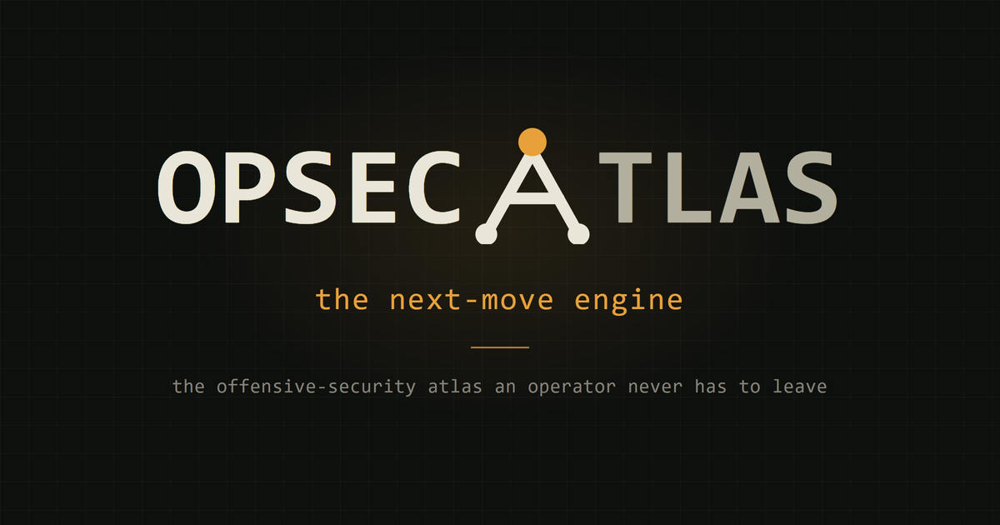
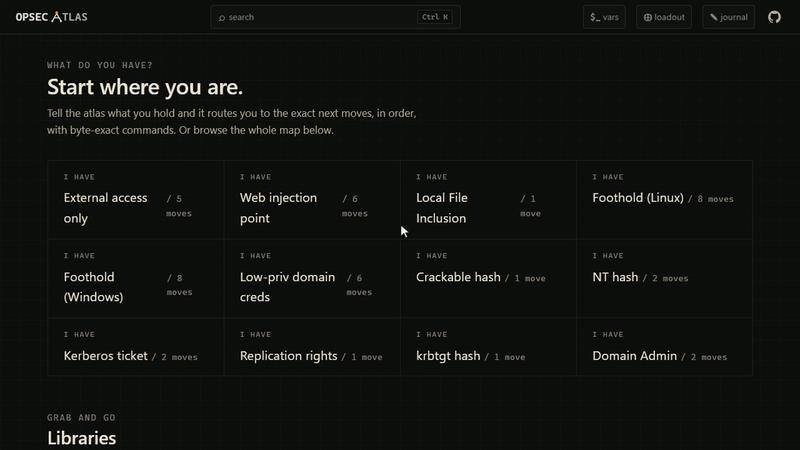

<div align="center">

<a href="https://opsecatlas.com"></a>

Set your target once, and every command across the atlas fills in: byte-exact, copy-ready, and fully offline.

[](https://opsecatlas.com)
[](LICENSE)
[](LICENSE-CONTENT)
[](#use-it)
[](#use-it)

</div>

---

## Why OpsecAtlas

Most reference material is passive: you find a command, adapt it to your target, and retype it, every single time. OpsecAtlas is active. Tell it what you already hold, and it routes you to the exact next moves in order, with every command already written for your engagement. The reference is the runbook.

## One session, end to end

<div align="center">

<a href="https://opsecatlas.com"></a>

</div>

A search lands on the exact command, your variables fill it in, you pin what you need to run, and the journal writes the report.

## Toolkit

Three tools turn the atlas from something you read into something you work from.

<table>
<tr>
<td width="33%" valign="top" align="center">

### Engagement Variables
Set your IP, target, domain, and creds once. Every command on every page fills in with your values, ready to copy.

</td>
<td width="33%" valign="top" align="center">

### Loadout
Pin any command, from anywhere, into one ordered, exportable <code>.sh</code> runbook.

</td>
<td width="33%" valign="top" align="center">

### Journal
Log findings, creds, and hosts as you work, then export a clean Markdown report.

</td>
</tr>
</table>

## What's inside

97 techniques, each mapped end to end: the exact commands, the payloads, and the next move. Everything is cross-linked, so from any technique you can see what leads in and what to do next.

| Library | What you get |
|---|---|
| **Payloads** | Copy-ready payloads and shells, variable-aware |
| **Commands** | Byte-exact, filled with your engagement |
| **CVEs** | Mapped to techniques and tooling |
| **OWASP** | The Top 10, cross-referenced to the atlas |
| **Tools** | The kit, with when-to-reach-for-it in context |
| **Wordlists** | Sorted for the job at hand |
| **Cloud** | Provider-specific attack paths |
| **References** | The sources, one search away |

One search lands on the exact line you need, with roughly 1,250 commands behind it.

## Use it

- **Now:** open [opsecatlas.com](https://opsecatlas.com). It runs in any modern browser.
- **Offline:** install it as a PWA (your browser's *Install app* / *Add to Home Screen*). The whole atlas, search included, then works with no network, ready for an air-gapped lab or a locked-down engagement.
- **Fast:** press <kbd>Ctrl</kbd>/<kbd>Cmd</kbd>+<kbd>K</kbd>, or just start typing, to search.

> **No accounts. No tracking.** Your engagement data stays on your device.

### Run it locally

```bash
git clone https://github.com/msk3d0ut/opsec-atlas.git
cd opsec-atlas
npm install
npm run dev
```

Built with Astro and Preact as a fully static PWA.

## Contributing

OpsecAtlas is docs-as-code: the whole reference is authored in Markdown and compiled into the app at build time. Adding a technique or fixing a command is a single Markdown pull request. A good contribution is a real technique, a verified command, or a correction. See [CONTRIBUTING.md](CONTRIBUTING.md) and the [technique template](.github/TECHNIQUE_TEMPLATE.md).

**The one rule above all:** commands are byte-exact and never reformatted. Trust in the commands is the product.

## Security and responsible use

OpsecAtlas is for authorized security testing, CTFs, labs, and research. Using these techniques against systems you do not own or have written permission to test is illegal, and you are solely responsible for how you use this material. To report a vulnerability in the app or site, see [SECURITY.md](SECURITY.md).

## Contact

- **General and licensing:** info@opsecatlas.com
- **Security disclosures:** security@opsecatlas.com ([SECURITY.md](SECURITY.md))
- **Conduct:** [CODE_OF_CONDUCT.md](CODE_OF_CONDUCT.md)

## License

- **Code** (the application): [MIT](LICENSE).
- **Content** (techniques, methodology, commands, payloads): [Creative Commons Attribution-ShareAlike 4.0](LICENSE-CONTENT).

Use it, fork it, build on it, even commercially, as long as you credit OpsecAtlas and keep derived content open under the same license.

---

<div align="center">

**Built for operators, by an operator.**

If OpsecAtlas earns a place in your workflow, a star is the only thank-you it asks for.

[](https://github.com/msk3d0ut) &nbsp;<sup>·</sup>&nbsp; [](https://x.com/msk3d0ut)

</div>
